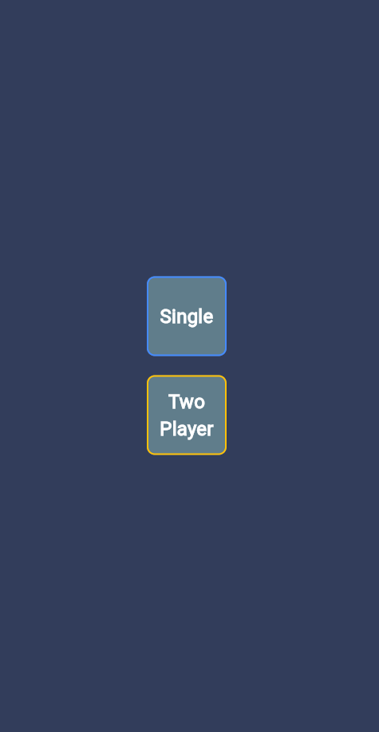
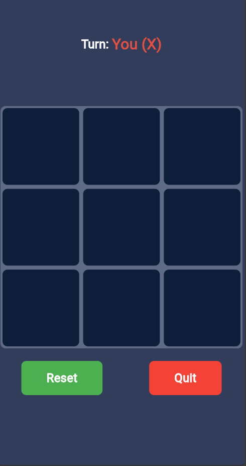
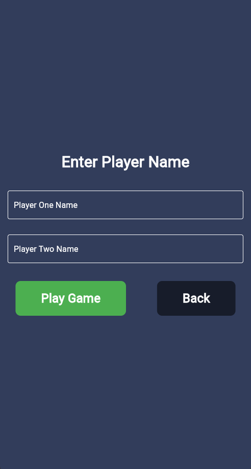
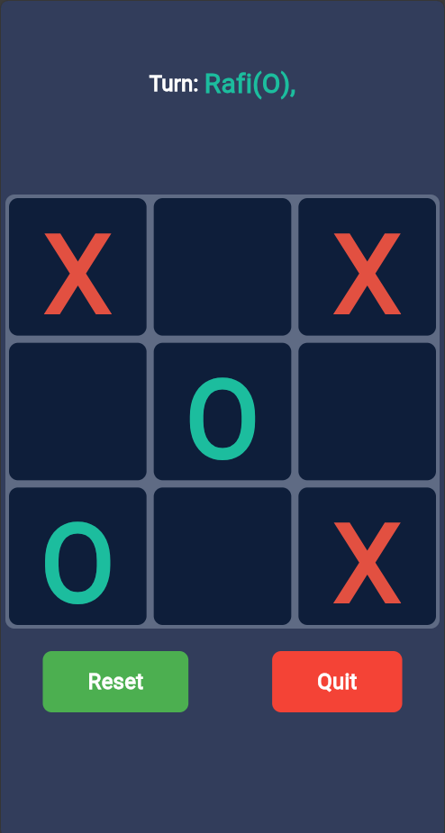

# tic_tac_toe

It's a Simple Game application. The AI(Bot) uses the Minimax Algorithm.

<h1>App Preview</h1>

<table style="width:100%">
  <tr>
    <th>Home Screen</th>
    <th>Single Playing with Bot</th>
    <th>Two People</th>
    <th>Two People Playing</th>
  </tr>
  <tr>
    <td></td>
    <td></td>
    <td></td>
    <td></td>
  </tr>
</table>

<h3>Need to improve the bot algorithom</h3>
<h4>Thank you for visiting</h4>
